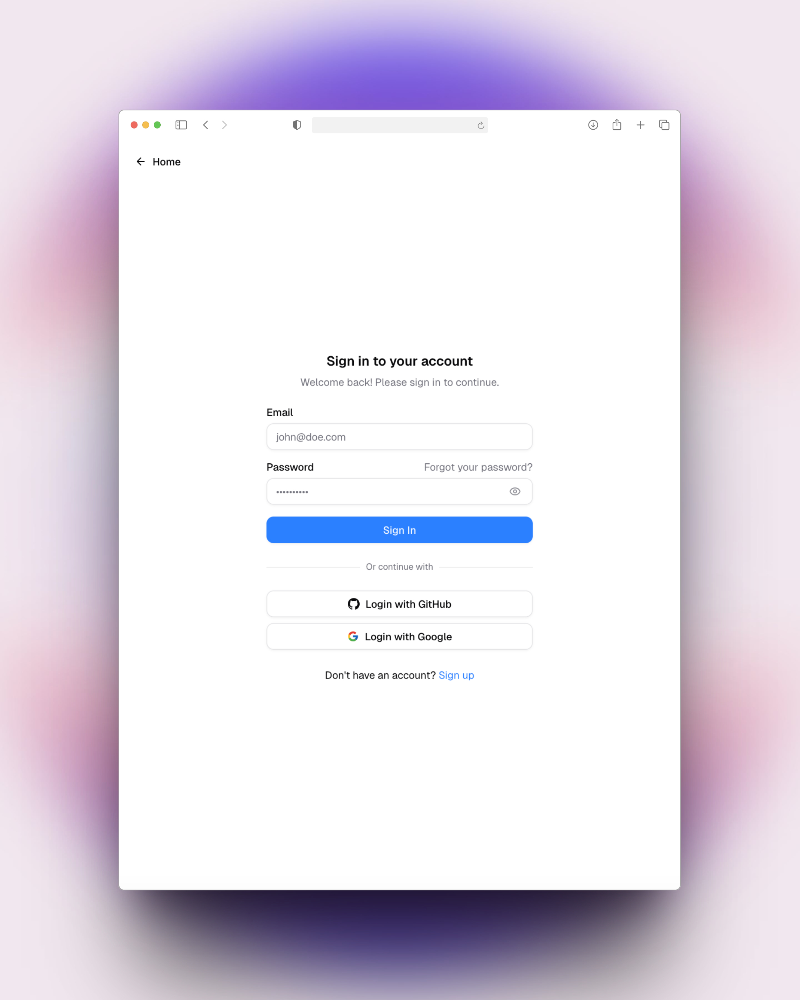
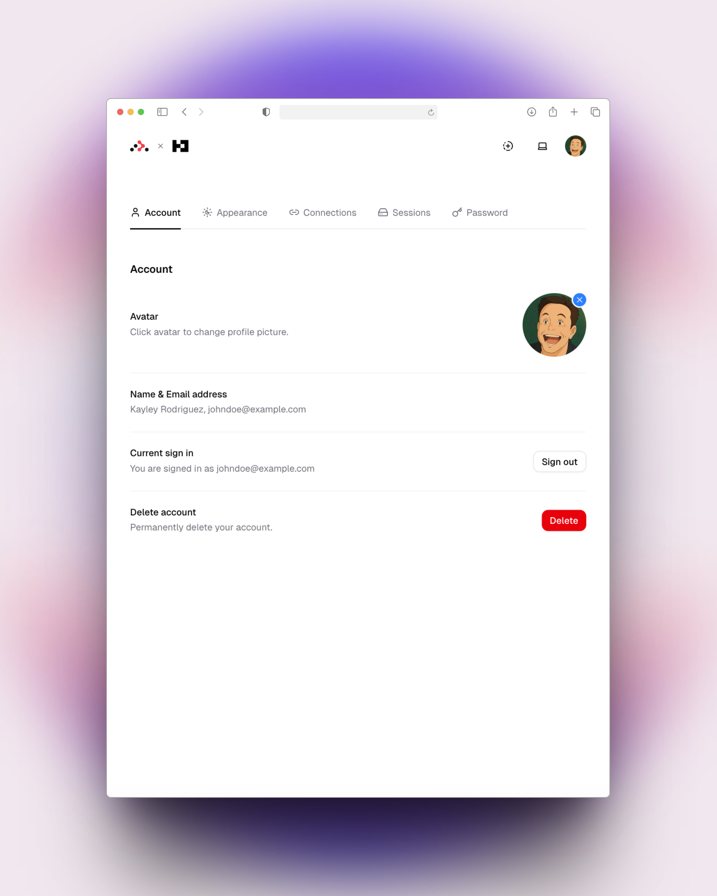

# React Router v7 with Better auth.

This template features React Router v7, Better auth, Drizzle ORM, and D1, designed for deployment on Cloudflare Workers.

## Features

- 🚀 Server-side rendering
- ⚡️ Hot Module Replacement (HMR)
- 📦 Asset bundling and optimization
- 🔄 Data loading and mutations
- 🔒 TypeScript by default
- 🎉 [TailwindCSS](https://tailwindcss.com/) and [Shadcn](https://ui.shadcn.com/) for UI styling
- 🔑 [Better Auth](https://better-auth.com/) for authentication
- 🌧️ [Drizzle ORM](https://orm.drizzle.team/) for database
- 🛢️ Cloudflare D1 for database
- 📁 Cloudflare KV for caching
- 📖 [React Router docs](https://reactrouter.com/)

## Demo

Here's a preview of the app:

<div style="display: flex;">
  
  
</div>

For more demo images, check the **.assets** directory.

## Links

React Router v7 Authentication Demo Series:
- [React Router v7 Cloudflare workers template](https://github.com/foxlau/react-router-v7-cloudflare-workers) - React Router v7 Cloudflare workers template.
- [React Router v7 with Remix Auth](https://github.com/foxlau/react-router-v7-remix-auth) - Multi-strategy authentication demo using Remix Auth

## Authentication Features

This template implements a complete authentication system using Better Auth with the following features:

- 📧 **Email and Password Authentication** - Secure login with email and password
- 🔑 **Password Recovery** - Forgot password and reset password functionality
- 🔄 **Social Login** - Sign in with Google and GitHub accounts
- 👤 **Session Management** - Secure session handling with Cloudflare KV storage
- 🗑️ **Account Management** - Including account deletion functionality

## Getting Started

### Installation

Install the dependencies:

```bash
git clone https://github.com/foxlau/react-router-v7-better-auth.git
pnpm install
```

### Development

Run an initial database migration:

```bash
cp .dev.vars.example .dev.vars
npm run db:apply
```

If you modify the Drizzle ORM schema, please run `npm run db:generate` first. If you need to delete the generated SQL migrations, execute `npm run db:drop` and select the SQL migration you wish to remove.

Start the development server with HMR:

```bash
npm run dev
```

Your application will be available at `http://localhost:5173`.

## Building for Production

Create a production build:

```bash
npm run build
```

## Deployment

Deployment is done using the Wrangler CLI.

Use the following commands to create the D1 database and KV cache for Better Auth sessions. Remember to replace the `db` and `kv` configurations in the `wrangler.toml` file with the data generated by these commands:

```bash
npx wrangler d1 create rr7-better-auth
npx wrangler kv namespace create APP_KV
```

To deploy directly to production:

```sh
npm run db:apply-prod
npm run deploy
```

To deploy a preview URL:

```sh
npm run deploy:version
```

You can then promote a version to production after verification or roll it out progressively.

```sh
npm run deploy:promote
```

## Questions

If you have any questions, please open an issue.
